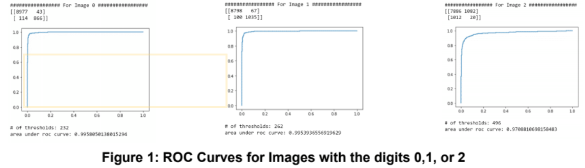

<div class="ui small rounded images">
  
</div>

Machine learning is producing models and analyzing large amounts of data to make conclusions about new data. Here, I used Python and Keras. Keras has built-in functions to analyze the datasets such as the MNIST handwritten digit set and the IRIS dataset. The MNIST dataset contains 60,000 test images to train the model, and 10,000 images to test the model. 

What I did for the project was to visualize the accuracy of my model by calculating the area under the curve of the True Positive Rate and the False Positive Rate. I did this by calculating the predictions for all images that are labeled 0. After this, I found the regression coefficients by fit it through the LinearRegression() function. I used the coefficients to be sorted against a threshold, then compared them to an array with the correct labels of each image. Then I calculated the TPR and FPR so that it can be graphed.
```py
for i in range (0, test_labels.size - 1):
    threshold= (sortedRawP[i] + sortedRawP[i+1]) / 2
    predictions=np.where(raw_predictions0 >threshold, 1,-1)
    actual=np.where(test_labels==n,1,-1)
    CM = confusion_matrix(actual,predictions0)
    TPR = CM[0][0] / (CM[0][0] + CM[0][1])
    FPR = CM[1][0] / (CM[1][0] + CM[1][1])
    arrTPR = arrTPR + [TPR]
    arrFPR = arrFPR + [FPR]
```


