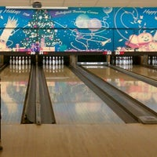

  

In my junior year of High School, I wanted to be a part of a extra curricular activity that was no a part of my school. I always had a constant interest in being a part of a sports team, so I joined the Schofield Bowling League. This is where is learned how to be proficient at bowling. It was also the first time that I forced myself to be in the uncomfortable sitation of getting to know new people. However, I did make some friends of all ages and all skill groups and got along with them until I graduated. The league was always on weekends, and they expected you to create your own practice schedule. I ended up practicing on Wednesday since it was the shortest school day of the week.

Being a part of the league has taught me that sometimes, you are the only person that you can rely on. You have to take the initiative to talk to people and ask for criticism to improve your skills at something. 
